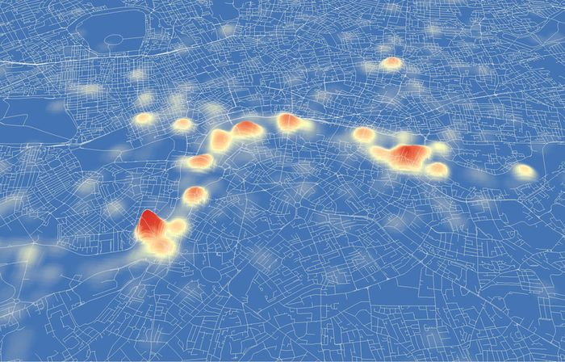
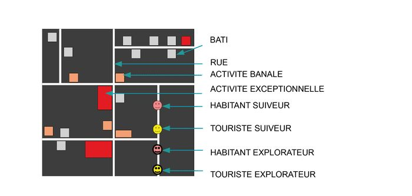
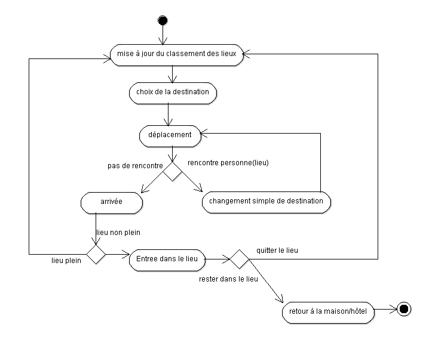
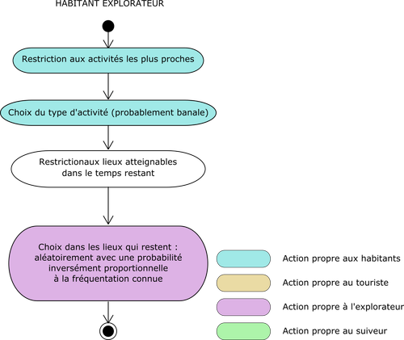
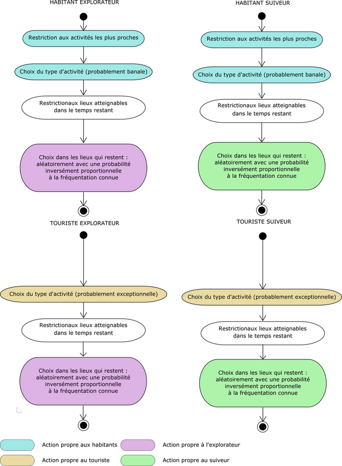
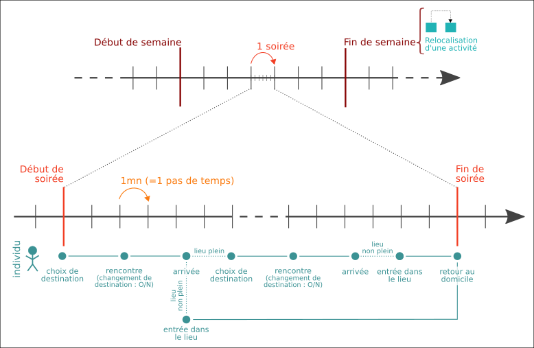
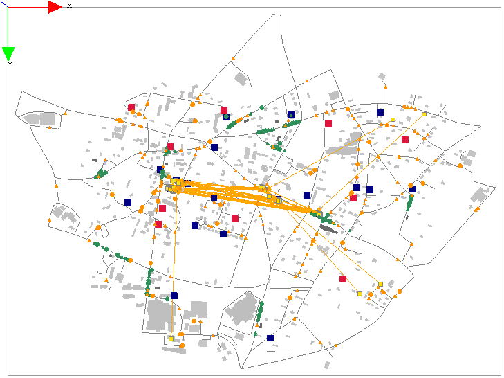
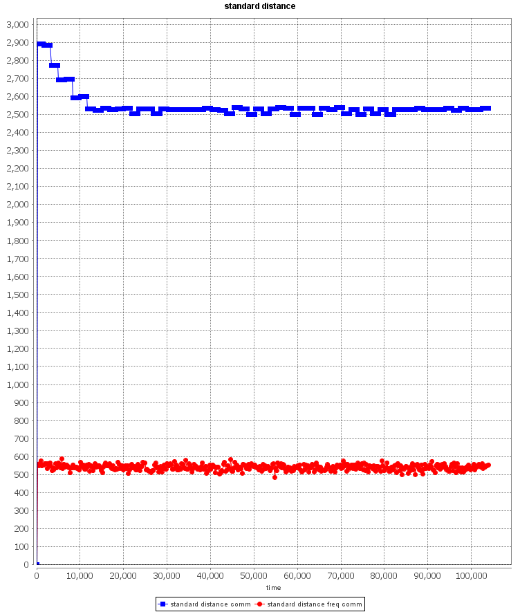

Fiche pédagogique | Modèle HOTSPOTS | Juin 2015
------|-------|--------
Collectif MAPS||MAPS8

**Domaines d’application**:
Géographie urbaine, analyse spatiale, réseaux sociaux, localisation d'activités commerciales

**Spécificité pédagogique**:
Développement d'un modèle avec la plate-forme GAMA et implémentation de réseaux d'informations spatiaux et a-spatiaux en interactions.

**Niveau du public visé**:
Débutant pour l’exploration du modèle (type public lycéen). Intermédiaire à avancé pour la partie développement (expérience de programmation souhaitée).

**Niveau thématique**: dynamique urbaine

**Nom du modèle correspondant**: HOTSPOTS v1.4

**Version GAMA nécessaire**: GAMA 1.6.1

**Auteurs**:
[Eduardo Gomes](mailto:eduardojonas@gmail.com) (Universités de Lisbonne, Université Paris 1 Panthéon-Sorbone, UMR Géographie-cités),
[Giovanni Fusco](mailto:Giovanni.FUSCO@unice.fr) (Université de Nice),
[Justin Delloye](mailto:justin.delloye@uclouvain.be) (Université Catholique de Louvain),
[Lucie Nahassia](mailto:lucie.nahassia@gmail.com) (Université Paris 1 Panthéon-Sorbone, UMR Géographie-cités) et
[Sophie Buessler](mailto:sophie.buessler@gmail.com) (Université de Strasbourg, LIVE-UMR 7362)

#Modèle HOTSPOTS

*Image : Manley, E. (2012)*

## Sommaire
[A. Définition du modèle](#A)  
[B. Contextualisation du modèle](#B)  
[C. Fonctionnement du modèle](#C)  
.... [C.1. Principe de base](#C.1.)  
.... [C.2. Formalisation UML](#C.2.)  
........ [C.2.1. Diagramme de classe ](#C.2.1.)  
........ [C.2.2. Diagramme d'activité pour le déroulement de la soirée](#C.2.2.)  
........ [C.2.3. Diagrammes d'activités pour les choix de destination](#C.2.3.)  
.... [C.3. Evaluation de la fréquentation](#C.3.)  
.... [C.4. Temporalités du modèle](#C.4.)  
[D. Exploration du modèle](#D)  
.... [D.1. Manipulation du modèle](#D.1.)  
.... [D.2. Exploration de l'espace des paramètres](#D.2.)  
[E. Conclusion](#E)  
[F. Perspectives](#F)  
[G. Bibliographie](#G)  

##<a id="A">A. Définition du modèle </a>

L'objectif de ce modèle est d'analyser l'émergence au cours du temps de hotspots (hauts lieux) de fréquentation dans un espace urbain en fonction de la diffusion spatiale et a-spatiale d’information entre agents hétérogènes.

En particulier, nous proposons à l’apprenant de manipuler un modèle lié à la dynamique de hotspots (lieu de fréquentation), d’en comprendre le fonctionnement puis d’agir sur celui-ci en testant différents paramètres (préférences des différents types de populations modélisées pour différents types d'activités, tolérance des différents types d'individus vis à vis des lieux très fréquentés, influence de la rencontre physique, influence du réseau social a-spatial, probabilité qu'un agent sort de son lieu d'activité...).

##<a id="B">B. Contextualisation du modèle</a>

Ces dernières années, les technologies de l'information se sont rapidement diffusées dans les pratiques sociales. En ce qui concerne les activités commerciales en particulier, les consommateurs peuvent aujourd'hui facilement échanger des informations sur des établissement via des sites internet spécialisés ou simplement via les réseaux sociaux.

Il n'est pas évident que ces nouvelles pratiques remplacent totalement les échanges d"information par contact direct, au sein de réseaux sociaux physiques par exemple liés à l'appartenance à un même voisinage. Certaines études suggère au contraire que les échanges numériques, soit majoritairement a-spatiaux, puissent générer plus d'échanges physiques, c'est-à-dire spatiaux (Glaeser, 2011).

Dans ce contexte, il est difficile d'anticiper l'importance respective de ces deux canaux d'informations sur l'émergence de *hauts lieux* urbains, c'est-à-dire de localisations intra-urbaines fortement fréquentées pour les activités qu'elles proposent. Le modèle suivant s'inspire donc de notre manière de choisir les lieux d'intérêts pour une sortie mondaine, en combinant les sources d'informations, pour étudier la fréquentation des activités urbaines qui en résulte. Les hypothèses sont conceptuelles et n'ont pas été basées sur une revue de littérature.

L'espace urbain modélisé est celui de Luneray en Normandie. Ce choix, peu approprié à la problématique soulevée, n'est pas contraignant ici puisqu'il s'agit d'un modèle éducatif.
En outre, l'infrastructure urbaine peut être à tout moment remplacée par celle d'un autre espace par une simple modificiation des shapefiles sources. Le choix d'intégrer une zone urbaine commerciale serait évidemment un plus pour le modèle.

## <a id="C"> C. Fonctionnement du modèle </a>

###<a id="C.1."> C.1. Principe de base </a>

L'espace urbain est constitué des bâtiments reliés par un réseau routier (Fig 1). Des activités se situent dans ces bâtiments et proposent aux individus, hétérogènes dans leur décisison, des services divers au cours d'un enchaînement de soirée (une soirée dure 4h, de 20h00 à 24h00). Les lieux sont choisis par les agents à différents moments de la simulation à partir de deux réseaux de nature différentes :
- un réseau d'information dit "a-spatial", représenant le mécanisme d'un réseau social ou d'un point d'information de type tripadvisor
- un réseau dit "spatial" correspondant à l'échange d'information entre des individus qui se rencontrent dans la rue.

  
_**Fig 1** Schéma des composantes du modèle_

Deux types de populations, qui se déplacent au cours de la soirée dans la ville sur les agents *routes* de l'espace urbain, sont modélisées sous forme d'agents différents :

- les *touristes*,
- les *habitants* locaux,

qui se distinguent par leur connaissance, globale ou locale, de la ville (cf. **C.2.3.**), et par le type d'activité qu'ils privilégient.

Chaque type est lui-même divisé en deux sous-groupes (attributs des agents):

- les *suiveurs* : agents qui ont plutôt tendance à suivre les autres agents et donc à aller dans les lieux les plus fréquentés,  
- les *explorateurs* : agents qui ont plutôt tendance à fuir les lieux les plus fréquentés.

Ainsi, la typologie des individus regroupe 4 quatre sortes d'agents, qui ont des schèmes de décisions des lieux à fréquenter différents :
- les touristes suiveurs
- les touristes explorateurs
- les habitants suiveurs
- les habitants explorateurs

Les *activités* sont modélisées sous forme d'agents et sont attribuées à un bâtiment. Elles peuvent être de deux types :

- Les activités *exceptionnelles*, attractions touristiques (monuments historiques par exemple) ou infrastructures publiques (musées par exemple), qui sont bien connues des touristes mais sont moins attractifs pour les habitants locaux.
- Les activités *banales*, telles que les bars et les dancings, qui sont connues des locaux mais pas des touristes.

Sont considérés comme hauts lieux les bâtiments proposant des activités très fréquentées par les agents au terme de plusieurs soirées. Toutes les semaines, une activité banale ferme pour cause d'insuffisance de fréquentation, et une nouvelle activité apparaît dans un bâtiment libre et situé sur une route fortement fréquentée.

Enfin, les agents bâtiments sont également des lieux de résidences pour les agents individus et sont séparés en deux types selon leur capacité de logement :

- Les *hôtels* accueillent des touristes en grand nombre, mais pas d'activité.
- Les *maisons* accueillent un habitant, et possiblement une activité.

###<a id="C.2."> C.2. Formalisation UML </a>

####<a id="C.2.1."> C.2.1. Diagramme de classe </a>

La plupart des classes correspondent directement à une des composantes du modèle (Fig 2) :

- *Global* regroupe les variables globales et les principaux processus dynamiques,
- *Road* est un segment viaire, qui peut être extrait d'un shapefile,
- *Building* est un bâtiment, qui peut aussi être extrait d'un shapefile. Ils sont des maisons ou des hôtels.
- *Activite* est une activité commerciale banale (café, bar, restaurant, etc.) ou exceptionnelle (bâti historique, musée, etc.). Les activités peuvent être générées aléatoirement ou être chargées à partir d'une table attributaire d'un shapefile.
- *Individus* est la classe-mère des agents mobiles, suiveurs ou explorateurs
- Les classes *touristes* et *habitants* héritent des *Individus* et correspondent aux agent de même nom,
- *Classement* est la liste des lieux représentant ce qu'un agent sait de la fréquentation des activités. Elle est mise à jour de façon spatiale et a-spatiale.

_**Fig 2** Diagramme de classes du modèle_

####<a id="C.2.2."> C.2.2. Diagramme d'activité pour la dynamique de déplacement des agents </a>

La dynamique de déplacement des agents individus au cours d'une soirée est décrite par la Fig 3 :

  
_**Fig 3** Diagramme d'activité pour le déplacement au cours d'une soirée_

En début de soirée, à 20h00, les individus se situent dans leur résidence, maison ou hôtel. Ils commencent par choisir un lieu de destination pour la soirée dans le classement des activités  (cf **C.2.3.**) et empruntent le plus court chemin sur le réseau pour s'y rendre.

Sur leur chemin, les individus se croisent physiquement dans les rues. Il existe alors une probabilité pour qu'un individu _A_ décide de remplacer sa destination _a_ par la destination _b_ d'un individu _B_ croisé dans la rue. Il s'agit d'un simple changement de destination, qui ne dépend ni de la nature (touriste, habitant) ni du type (suiveur, explorateur) des agents qui se rencontrent.

Une fois arrivé à destination, si le bâtiment où se situe l'activité choisie est plein, l'individu ne peut y entrer et choisi une nouvelle destination en constultant à nouveau le classement des activités. Sinon, il rentre dans le lieu, qui devient alors plus fréquenté.

Au cours du temps restant pour la soirée, l'individu a une probabilité de sortir du lieu et de recommencer ce processus pour aller fréquenter une autre activité.

A 24h00, tous les individus sont instantannément relocalisé dans leur bâtiment de résidence.

A la fin de chaque semaine (soit 7x4h), l'activité banale qui a été la moins fréquentée se relocalise dans un bâtiment ne contenant pas déjà une activité et situé sur un tronçon de route fortement fréquenté. Tous ses attributs relatifs à sa fréquentation sont remis à zéro : on considère ainsi qu'il s'agit d'une nouvelle activité.

####<a id="C.2.3."> C.2.3. Diagrammes d'activités pour les choix de destination </a>

Le modèle comporte quatre diagrammes d'activités qui permettent de moduler les choix de destination des agents selon son type. Le commentaire se limite aux agents de type *habitant explorateur* (Fig 4), les autre diagrammes sont construits avec des règles complémentaires (Fig 5).

  
_**Fig 4** Diagramme du choix de l'habitant explorateur_

Le diagramme ci-dessus signifie que l'habitant explorateur réalise un certain nombre d'actions selon l'ordre suivant :  
1) D'abord, l'agent habitant commence par se restreindre aux activités le plus proche de lui. Ceci modélise une connaissance ou une préférence de l'habitant pour les activités locales.  
2) Ensuite, il choisit le type d'activité (avec une probabilité plus forte pour une activité banale).  
3) Puis, il se restreint aux activités qu'il pourra atteindre avant minuit.  
4) Finalement, il choisit une activité dans l'ensemble restant, aléatoirement, avec un probabilité inversement proportionnelle à la fréquentation connue.  

Le fréquentation connue est donnée par un classement, propre à chaque individu, qui associe à certaines activités une valeur de fréquentation. Pour une même activité, différents agents peuvent donc avoir différentes informations sur la fréquentation. Le principe de base est que le classement des touristes n'est pas biaisé spatialement, alors que celui des habitants l'est.

Concrètement, les agents touristes partagent tous le même classement qui s'interprète donc comme une liste publique d'informations sur toutes les activités de la ville. Chaque fois qu'il entre dans une activité, le touriste le signale donc sur ce classement commun. Par contre, les agents habitants ont chacun un classement qui est spatialement biaisé de deux manières. D'abord, un habitant ne connaît initialement que les activités proches de sa résidence. Ensuite, lorsqu'il entre dans une activité, il ne le signale pas dans les classements de tous les agents mais seulement dans ceux de ses _amis_. Les amis d'un habitant sont simplement définis en début de simulation comme tous les autres habitants résidant à une certaines distance de son domicile. Il s'agit donc d'un deuxième effet de voisinage.

  
_**Fig 5** Diagramme du choix de tous les types d'individus_

###<a id="C.3."> C.3. Temporalités du modèle </a>

Les dynamiques modélisées correspondent à plusieurs échelles temporelles :

- échelle micro : le pas de temps de la simulation représente _1min_ ;

- échelle meso : une _soirée_ ("day" dans l'implémentation) représente les _4h de 20h00 à 24h00_ pendant lesquelles les individus se déplacent depuis leur résidence vers une ou plusieurs activités, puis retournent à leur résidence (240 pas de simulation) ;

- échelle macro : une _semaine_ correspond à 7 soirées (1 680 pas de simulation). A son terme l'activité la moins fréquentée pendant le cycle change de localisation selon le processus décrit en **C.2.2.**.

  
_**Fig 6** Temporalitées emboîtées du modèle et trajectoires possibles d'un individu_

Ainsi le modèle peut s'analyser à chacune de ces échelles, par exemple :
- les motifs de déplacement des individus au cours de la soirée,  
- le bilan des fréquentation des bâtiments et de passage dans les rues à la fin de chaque soirée,
- la moyenne de ces valeurs et la relocalisation des activités après un ou plusieurs cycles
- ...

###<a id="C.4."> C.4. Evaluation de la fréquentation </a>

Dans notre modèle, les hotspots sont définis comme les lieux de forte fréquentation. Différentes valeurs de fréquentation ont donc été définies, à pour deux types d'agents :

**1.** Les agents activités possèdent plusieurs attributs de fréquentation qui s'incrémentent à chaque fois qu'un agent individu rentre dans le bâtiment qu'elles occupent.
> La valeur "frequentation" est remise à 0 au début de chaque soirée.  
La valeur "freq_week" est remise à 0 au début de chaque semaine.  
La valeur "f" correspond à la fréquentation d'une activité pour la soirée rapporté à la somme des fréquentations de toutes les activités.

**2.** Les agents bâtiments possèdent un attribut "passage" qui s'incrémente à chaque fois qu'un individu agent est dans un buffer de 10m autour du bâtiment. Il est remis à 0 toutes les semaines. Cette valeur permet d'identifier, via les bâtiments, les rues qui connaissent le plus de passage des individus qui se rendent d'activité en activité. On peut ainsi déterminer des lieux de forte fréquentation dans la ville en dehors des seuls bâtiments ayant une activité banale ou exceptionnelle.  
Cette valeur est également utilisée, à la fin de chaque semaine, pour le choix de relocalisation de l'activité la moins fréquentée (cf **C.2.2.**).

La fréquentation des activités et le passage devant les bâtiments peut être visualisée au cours de la simulation via deux cartes, actualisées respectivement à chaque fin de soirée et chaque fin de semaine.

  
_**Fig 7** Carte de fréquentation des activités à la fin d'une soirée (rouge : très fréquentée - rose : moins fréquentée)_

##<a id="D"> D. Exploration du modèle </a>

###<a id="D.1."> D.1. Manipulation du modèle </a>

En guise de manipulation, le modèle a été testé avec ses paramètres initiaux sur un intervalle simulé de plus d'un an. Sur la carte globale du système (Fig 7), les maisons sont en gris clair, les hôtels sont en gris foncé et les routes sont en noir. Les touristes y sont représentés en vert et les habitants en orange, les explorateurs sont représentés par des triangles et les suiveurs par des ronds. Enfin les activités exceptionnelles sont représentées par des carrés rouge et les activités banales par des bleu. Chaque semaine, lorsqu'une activité banale se déplace, sa localisation initiale est marquée par un petit carré jaune qui est lié à la nouvelle localisation par une flèche orange.

  
_**Fig 8** Carte de l'état du système après 1 an et 1 mois_

Dans les conditions par défaut, il apparaît que les activités ont tendance à se concentrer en deux endroits centraux. On peut observer que les activités quittent l'est et le sud de la zone d'étude pour se concentrer en deux carrefours au centre, et que les déplacements d'activités se produisent ensuite essentiellement entre ces deux lieux. Cette polarisation se retrouve dans dispersion des localisation des activités, mesurée par la distance standard non pondérée, qui diminue au cours du temps (Fig 8). Notez que la mesure pondérée est quant à elle constante.

  
_**Fig 9** Evolution de la dispersion des activités commerciales sur 1 an et 1 mois_

Notons que certaines activités banales restent malgré tout en bordure, ce qui signifie qu'elles n'ont pas un taux de fréquentation minimal. Ces activités sont en effet toutes à proximité d'une activité exceptionnelle, donc immobile, ou d'un hôtel qui assure une fréquentation raisonnable du lieu en toute circonstance.

###<a id="D.2."> D.2. Exploration de l'espace des paramètres </a>

Les principaux paramètres du modèles sont ceux qui sont susceptibles de renforcer ou affaiblir l'influence d'un réseau d'information sur la fréquentation physique des lieux (Fig 9).

Tout d'abord, l'utilisateur peut agir sur la composition de la population : stock total, ventilation en touristes/habitants et en explorateurs/suiveurs.

D'autre part, il est possible de déterminer la préférence de chaque type d'agent pour les activités banales ou exceptionnelles, ainsi que la probabilité générale de quitter une activité, ce qui exprime le temps moyen qu'un agent passe dans une activité.

On peut  également paramétrer la portée dans laquelle sont incluses les activités qui constituent la "connaissance locale" des habitants.
Enfin, il est possible de fixer la probabilité selon laquelle un individu change sa destination lors d'un croisement dans la rue.

  
_**Fig 10** Paramètres principaux du modèle_

L'étude de la sensibilité du modèle à ces paramètres nous semble cruciale pour déceler les conditions d'émergence des haut-lieux de fréquentation.

En outre, d'autres paramètres pourraient être ajoutés. Par exemple, il nous parait important de tester l'influence des caractéristiques morphologiques du réseau routier puisque celui-ci influence le nombre de rencontres urbaines. De même pour la répartition des bâtiments.

##<a id="E"> E. Conclusion </a>
D'un point de vue scientifique, les comportements simplifiés des agents implémentés permettent de mettre en évidence l'influence croisée des réseaux spatiaux et a-spatiaux sur la localisation des hauts-lieux urbains. En effet, bien que l'analyse de sensibilité soit laissée à l'utilisateur, les paramètres repris ci-dessus permettent de pondérer l'influence d'un type de réseau ou de l'autre sur la décision de sortie des agents, et par extension sur la décision de localisation des activités.

D'un point de vue didactique, ce modèle sensibilise à l'importance des phénomènes a-spatiaux dans les processus de déplacements et de localisations. L'application à un contexte urbain est particulièrement parlante. Cette problématique soulève quelques défis techniques qui constituent une autre source d'apprentissage. En effet, l'intégration des caractères spatiaux et a-spatiaux dans le processus de choix de destination s'est fait séquentiellement, dans un ordre argumenté mais certainement pas immuable, et qui influence considérablement la décision.

Enfin pour l'enseignant, la distinction des paramètres clés permet de réaliser des simulation simplifiées : d'abord sans échanges a-spatiaux, ensuite sans échanges spatiaux, et enfin en combinant les deux. Le visualisation successive de ces paramétrisations extrêmes permet d'améliorer la compréhension finale du système modélisé.

##<a id="F"> F. Perspectives </a>

Plusieurs pistes prometteuses sont apparues lors du développement de ce modèle.

Premièrement, il serait intéressant de raffiner l'information de fréquentation partagée sur les réseaux sociaux par une information de qualité. Les agents pourraient ainsi partager des avis positifs ou négatifs sur une activité, selon des critères dépendant de leur type (touriste/habitant mais surtout suiveur/explorateur).

Deuxièmement, il serait intéressant d'introduire un phénomène de *découverte* des activités urbaines. Un agent pourrait par exemple, au cours de ses déplacements, se laisser tenter par une activité qui se trouve sur son chemin, même sans en avoir entendu parlé auparavant.

Dans le même ordre d'idée, la caractère planifié des soirées implémentées ici semble exagéré. Ainsi, il serait plus réaliste d'insérer du bruit dans cette planification *via*, par exemple, des agents qui se baladeraient aléatoirement et pourraient eux aussi se laisser tenter par une activité croisée sur leur chemin. L'intérêt serait alors de voir sous quelles conditions ces déplacements non-planifiés viendraient changer les conclusions tirées ci-dessus. 

Troisièmement, dans l'état actuel du modèle, l'organisation spatiale des hotspots émerge d'interactions locales (spatiales et a-spatiales) : il s'agit d'un processus bottom-up. Cependant, seules les activités banales peuvent se relocaliser au cours du temps, les activités exceptionnelles, de par leur nature, son immuables. Il serait ainsi interessant de modéliser l'apparition de nouvelles activités exceptionnelles, qui seraient localisées par un agent et selon des règles _a priori_ extérieures au système (de type intervention du pouvoir public). On pourrait ainsi observer et tester les effets entremelés de processus d'émergence et de processus top-down sur l'organisation spatiale de l'espace intra-urbain.  
Ceci pourrait être implémenté de manière interactive : l'utilisateur mettrait la simulation en pause à un moment donné et choisirait un ou plusieurs bâtiments auxquels il attribuerait une activité exceptionnelle.

Enfin, certaines questions soulevées n'ont pas été traitées dans ce document. Par exemple, l'impact des échanges a-spatiaux sur la structure du réseau spatial n'a pas été discutée. Pour ce faire, il serait intéressant d'introduire des indicateurs de sortie spécifiques comme une caractérisation des graphes représentant chaque réseau à différents moments des simulations. De même, il serait intéressant de multiplier les indicateurs liés à une question spécifique car certains s'avèrent plus pertinents que d'autres. Par exemple, dans ce document, la distance standard pondérée entre les activités n'apportait pas d'information. Un coefficient de Gini pourrait quant à lui apporter une lecture a-spatiale de la concentration des activités.

##<a id="G"> G. Bibliographie </a>

Glaeser, E. (2011). *Triumph of the City: How Our Greatest Invention Makes Us Richer, Smarter, Greener, Healthier, and Happier*. New-York, United-States: Penguin Group, Penguin Press

Manley, E. (2012). "The Diamond Jubilee in London: A Tweet Location Analysis", à voir sur *UrbanMovements* (blog) [http://urbanmovements.co.uk/2012/06/08/136727921/](http://urbanmovements.co.uk/2012/06/08/136727921/), dernière visite le 08 juillet 2015