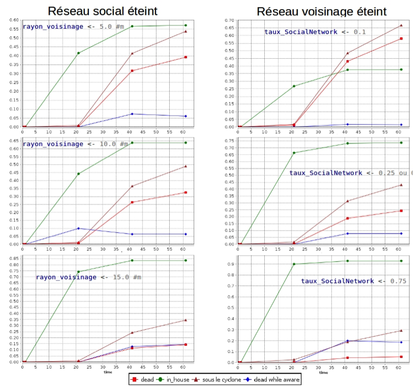

Fiche pédagogique | Modèle CyChro | Juin 2015
------|-------|--------
Collectif MAPS||MAPS 8

**Domaine d’application **: 
Réseaux sociaux, Gestion de crise, risques naturels

**Spécificité pédagogique **:
Modèle de diffusion de messages sur différents réseaux sociaux et l’impact sur la population dans le cadre d’une crise cyclonique

**Niveau du public visé **:
Débutant

**Nom du modèle correspondant **:
CyChro

**Version NetLogo nécessaire **: GAMA 1.6.1

**Auteurs **: [Mahé BEN HAMED](mailto:mahe.benhamed@gmail.com), [Imen BOUHLEL](mailto:Imen.BOUHLEL@unice.fr), [Delphine GRANCHER](mailto:Delphine.GRANCHER@lgp.cnrs.fr), [Carlos SUREDA GUTIÉRREZ](mailto:csureda@irit.fr)

#CyChro

__Introduction et problématique__

Le modèle CyChro est utilisé pour montrer l’influence des réseaux sociaux dans la gestion d’une crise et plus concrètement l’arrivée d’un cyclone. L’objectif de cette fiche pédagogique est de présenter le modèle depuis plusieurs points de vue. Tout d’abord les aspects généraux concernant les réseaux sociaux et la gestion de crise sont présentés. Ensuite, le fonctionnement et l’implémentation du modèle sont analysés en faisant varier plusieurs paramètres.

S’agissant d’un modèle de simulation sociale montrant la dynamique du comportement humain,  les hypothèses initiales méritent d’une attention considérable car le réalisme  et la pertinence du modèle en dépendent. Les hypothèses qui ont été définies à son origine n’ont pas été remises en cause. L’idée est d’atteindre un bon niveau d’expression en respectant ces hypothèses.

Enfin, plusieurs indicateurs de sortie sont analysés, permettant de conclure sur la robustesse et pertinence du modèle. Ils permettent également de répondre à la question initiale, à savoir l’influence des réseaux sociaux sur la population, une question qui est toujours au centre de l’étude à chaque étape.

Le cas d’application choisi est la ville de Luneray, dont l’aire étudiée correspond environ à un espace de 1500m x 1500m.

## Définition du modèle
L’idée principale que le modèle met en valeur est l’impact de l’information venant des réseaux sociaux sur la population au moment d’une crise cyclonique. Dans cette version du modèle, trois réseaux sont pris en compte, et chaque réseau émet un type d’alerte :

* Réseau institutionnel : il s’agit du réseau géré par une institution de gestion de crise, par exemple la préfecture, la police, la croix rouge ou un organisme spécialisé dans ce type d’évènement. Dans notre modèle, l’information au sein de ce réseau est diffusée sous la forme d'alertes sonores qui sont produites par des sirènes fixes installées aléatoirement dans des bâtiments de la ville. 

* Réseau de voisinage : ce réseau représente la diffusion d’information connue informellement comme le « bouche-à-oreille ». Les alertes dans ce réseau sont des messages transmis directement d’une personne à une autre.

* Réseau Facebook: il s’agit du seul réseau qui n’est pas spatialisé, car les habitants faisant partie de ce réseau sont connectés virtuellement. Dans ce réseau, une alerte correspond à une information diffusée de deux façons différentes :
    * Soit un message envoyé par une personne à certains de ses amis
    * Soit un message publié sur le profil (mur) d’une personne

Le modèle prend également en compte la confiance accordée à chaque source  d’alerte, qui est différente pour chaque habitant, ce qui respecte l’hétérogénéité des croyances au sein de la population.

Néanmoins, plusieurs hypothèses ont été prises en compte : 

* Un habitant qui reçoit et croit à une alerte rentre chez lui (en fonction du nombre d’alertes reçues, cf. Fonctionnement du modèle)
* Un habitant qui est chez lui ne risque rien en ayant été suffisamment alerté
* La vitesse de déplacement des habitants est ralentie quand il dans « la foule » et accélérée lorsqu’il est très près du cyclone
* Si un habitant n’est pas chez lui  ou chez lui mais sans avoir pris de précaution quand le cyclone arrive, il n’a aucune chance de survivre
* Le relief de la ville n’est pas pris en compte.
* La population est isolée, toutes les informations sont endogènes.
* Un message ne contient pas de fausses informations
* Chaque personne « choisit » ou non de transmettre le message qu’il a reçu par les réseaux dont il est membre
* La trajectoire  réelle du cyclone n’est pas connue des habitants

Le modèle a été formalisé pour que son fonctionnement (cf. paragraphe C) respecte ces hypothèses.

## Contextualisation du modèle

La gestion des crises naturelles à l’aide des réseaux sociaux online (Twitter, Facebook, etc.) est un domaine en plein essor du fait de la masse de données disponible (Big Data) et des méthodes associées. C’est dans ce contexte que s’inscrit le modèle CyChro.

Plusieurs questions peuvent aider à appréhender le modèle, notamment par rapport au contexte réel :

__Peut-on considérer qu'un message d’alerte est toujours perçu comme totalement pertinent ?__
Cette question recouvre plusieurs problématiques qui ont été abordées lors de la conception du modèle :

* Qualité du message : comme vu précédemment, une des hypothèse concerne la pertinence du message reçu par une personne. Le modèle ne prend pas en compte l’aspect « information manquante » ni les erreurs de communication. 
* Rumeurs : de même, la notion de rumeur n’est pas explicite dans le modèle, bien que les habitants puissent faire confiance à chaque message, ce qui peut être associé à une sorte de filtrage de rumeurs.

__Se diriger chez soi est-elle la seule option pour les habitants avertis ?__
Dans cette version du modèle, les habitants avertis de l’arrivée du cyclone ont deux options, faire confiance aux alertes et rentrer chez eux, ou ne pas faire confiance aux alertes et continuer à se déplacer dans la ville. La question d’un emplacement servant d’abri pour les habitants a été évoquée mais finalement n’a pas été prise en compte du fait du manque de réalisme pour certaines populations qui ne possèdent pas ce type de bâtiment.

__Pourquoi considérons-nous la maison de l’habitant comme un endroit totalement sur ?__
Il s’agit d’une simplification et hypothèse de départ qui nous a permis de nous focaliser sur la compréhension de la dynamique de la population par rapport aux réseaux sociaux, qui est l’objectif principal du modèle. L’ajout d’une probabilité de décès liée à la qualité des installations aurait certes ajouté une difficulté supplémentaire à notre objectif principal, à savoir l'analyse de l'impact des réseaux sociaux.

__Zone d’impact réel autour du cyclone__
Si dans un contexte réel les dommages autour du cyclone sont non négligeables, le modèle actuel considère uniquement les habitants sous le cyclone comme des victimes potentielles.

__La confiance dans un message est totalement subjective. De plus, dans le cas du voisinage, c’est fortement corrélé à la personne qui a communiqué le message.__
Notre modèle s’inscrit dans une simulation multi-agents dans laquelle les habitants ont des comportements hétérogènes, à savoir la décision de faire confiance ou non à un message. Par conséquent,  la subjectivité doit être explicitée dans le modèle. Toutefois, cette source d’hétérogénéité est prise en compte uniquement dans le sens (habitant, réseau) et non pas (habitant, habitant). Autrement dit, il n’y a pas un profil de personne de « confiance ».

__Les personnes valident très souvent l’information venant de Twitter ou de Facebook avec d’autres sources d’information sur Internet.__
Il s’agit d’une hypothèse du modèle : l’information n’est contenue que dans la population elle même, aucune source d’information externe est prise en compte. Ainsi, dans le réseau Facebook, les messages sont émis uniquement par les habitants ayant un compte sur Facebook et faisant partie de la population.  

__Approches existantes__
Beaucoup d’auteurs s’intéressent à la gestion des crises à travers l’utilisation des réseaux sociaux. En ce qui concerne les plateformes existantes, [Rogstadius et al. 2013] développent « CrisisTracker », dans lequel ils utilisent exclusivement des messages provenant de Twitter, auxquels ils appliquent un algorithme d’extraction d’information. [Okolloh 2009] propose « Ushahidi », une plateforme collaborative qui est spécialisée dans l’analyse de données des smartphones et pas uniquement des réseaux sociaux. Enfin, [Yin et al. 2012] analyse les messages de Twitter avec un algorithme de clustering et de « burst detection », qui leur permet de détecter automatiquement des messages considérés potentiellement comme le début d’une crise. 
Le modèle CyChro décrit dans ce document utilise des réseaux spatialisés en plus du réseau Facebook.

## Fonctionnement du modèle

La première étape pour appréhender le fonctionnement du modèle correspond à l’étape conceptuelle, dont nous détaillons le diagramme de classes et le diagramme d’activité ci-dessous

__Diagramme de classes__
D’un point de vue conceptuel, le modèle se compose de 3 entités principales : un habitant, un cyclone et une sirène, qui communiquent entre eux à travers des messages d'alerte.

__Diagramme d’activité__
Le scénario ci-dessous est relatif à l’arrivée d’un message et les actions correspondantes effectuées par un habitant. À chaque nouveau message, il met à jour son vecteur de croyances et décide d’abord s’il envoie un message et si oui, sur lequel des réseaux. Deux actions sont possibles par la suite : soit rentrer chez lui, soit continuer à se déplacer.

Pour une compréhension approfondi du fonctionnement, voici la liste des paramètres du modèle, par rapport à chaque entité:
* Sirènes
    * Nombre de sirènes
    * Rayon d’émission des sirènes
* Habitants
    * Nombre d’habitants
    * Confiance en sirènes
    * Confiance en Facebook
    * Confiance en voisinage
    * Rayon du voisinage
    * Égoïsme avec le voisinage (influence la diffusion des messages)
    * Égoïsme en Twitter (influence la diffusion des messages)
    * Taux d’habitants dans Facebook
* Cyclone
    * Vitesse du cyclone
    * Rayon d’action du cyclone

Compte tenu de ces paramètres,  le processus de réception et de diffusion d’un message est le suivant :
* Si un habitant est dans le rayon d’émission d’une sirène, ou s’il reçoit un message d’un autre habitant ou un message de Facebook, sous réserve qu’il fasse partie des personnes qui écoutent les sirènes, communiquent avec leur voisinage ou possède un compte Facebook
* L'habitant décide de diffuser dans le voisinage en fonction de son égoisme, qui diffère pour le réseau online et pour le réseau de voisinage. L’égoïsme correspond ici à la propension qu'un habitant a à relayer l'alerte qu'il reçoit. 
* Il peut aussi décider de diffuser dans Twitter s’il fait partie de ce réseau et si son égoïsme le permet 
* Ensuite, s’il croit suffisamment aux messages qu’il a reçus, il va se mettre a l’abri
* Sinon, il continue à se déplacer sur les routes.

Les sirènes émettent une alarme avec une fréquence relative à la distance au cyclone. Un habitant qui est dans le rayon du cyclone ne peut plus diffuser des messages. De même, une sirène est désactivée lors qu’elle est dans le rayon du cyclone.

__Présentation de l’interface et manipulation du modèle__
La visualisation du modèle spatialisé ainsi que les différentes étapes de la simulation sont présentés ci-dessous.

__Simulation: état initial.__

La fenêtre de simulation est présentée ci-dessus. Le cyclone, en haut à gauche, va apparaître et se déplacer selon la trajectoire estimée (en rouge). Les habitants, qui n’ont pas encore reçu d’alerte, sont en jaune. Les sirènes, représentées par un triangle, sont désactivées, en noir. Les bâtiments sont représentés avec des polygones gris.

__Simulation: premières alertes et zone de diffusion__

Le triangle gris correspond à la zone de diffusion d’alertes, autrement dit la zone considérée en danger par rapport au trajet estimé du cyclone. Dans l’image ci-dessus, les sirènes (en jaune) diffusent déjà des alertes sonores.

__Simulation : premiers habitants avertis__

Les habitants avertis deviennent verts (image ci-dessus) et ne deviennent vert foncé que quand ils décident de rentrer chez eux.

__Simulation : premières victimes__

Enfin, les victimes (en rouge) qui font partie de trois types d’habitants :
* ceux qui n’ont pas été avertis
* ceux qui n’ont pas fait confiance aux alertes
* ceux qui n'ont pas eu le temps de rentrer chez eux

## Exploration du modèle

Pour le gestionnaire de crise, l'objectif est bien sûr de minimiser le nombre de victimes, mais aussi le nombre de personnes qui se trouvent en danger sous le cyclone. Pour cela, il a besoin de comprendre comment l'interaction des différents réseaux de diffusion de l'alerte se traduit en termes de létalité et de dangerosité du cyclone. Certains des paramètres pourront être contrôlés (par exemple en ajustant le nombre de sirènes en fonction de leur rayon d'action et de la densité de la population à alerter), alors que d'autres sont impondérables (comme la confiance qu'un habitant choisit d'attribuer à chaque source d'information, ou sa disposition à diffuser l'information à ses voisins ou à ses amis/followers sur le réseau social online). Il peut donc être utile pour le gestionnaire :

* d'une part d'explorer l’effet des interactions entre les réseaux de diffusion d'information non-officiels (voisinage et réseau social) et le réseau officiel (sirènes) sur l'efficacité de la diffusion d'alerte ; 
* d'explorer l'effet de la disposition à diffuser l'information sur l'efficacité de l'alerte, pour mettre en place des campagnes de sensibilisation de la population ou des relais d'alerte au niveau des différentes communautés - réelles et virtuelles.

Gardez à l'esprit que les résultats numériques changent d'une simulation à l'autre. Dans une première étape d'exploration du modèle, on cherche surtout une tendance qui pourra être confirmée par une analyse de sensibilité en bonne et due forme. Vous pouvez lancer quelques simulations à paramètres égaux, et observer si une tendance se dessine qui vous informe sur le comportement du modèle qui mériterait d'être explorée plus exhaustivement. 

__Explorer l’effet des interactions entre les réseaux de diffusion d'information non-institutionnel (voisinage et réseau social) et le réseau institutionnel (sirènes) sur l'efficacité de l'alerte.__

Dans ce cadre, on conserve une hétérogénéité de la confiance qu'accorde chaque agent à chacun réseaux non-institutionnel (attribution aléatoire). La confiance accordée aux sirènes, elle, est maximale (égale à 1) pour tout le monde. 

Les indicateurs qui nous intéressent ici sont :
* _dead_ : proportion de la population totale qui est victime du cyclone
* _in_house_ : proportion de la population totale qui s'est mise en sécurité 
* _sous_le_cyclone_ : proportion de la population totale qui s'est retrouvée en danger sous la zone d'impact du cyclone, et qui constitue un indicateur des victimes potentielles.
* _dead while aware_ : proportion de morts qui avait reçu une information d'alerte.

__Exercice 1__: Si on fait abstraction des réseaux non-institutionnels - plus difficiles à contrôler, quelle est la structure la plus efficace pour le réseau d'alerte institutionnel (sirènes) ? Est-il préférable d'avoir beaucoup de sirènes à faible rayon d'action (postes de polices, mairies ou écoles), ou moins de sirènes avec un plus grand rayon d'action ? 

__Paramètres à régler__ : _seuil_diffusion, nb_sirene, rangeSiren_

__Manipulation__ : En éteignant les réseaux de diffusion non institutionnels (_seuil_diffusion_ <- 0.0), jouer en sens inverse sur _nb_sirene_ et _rangeSiren_. Par exemple, pour _nb_habitant_ <- 1000, tester ces deux scénarios :

1. _nb_sirene_ <- 200 et _rangeSiren_ <- 25.0 #m
2. _nb_sirene_ <- 50 et _rangeSiren_ <- 100.0 #m

_Qu'observez-vous ?_ 
__Réponse :__

La tendance générale pour ces deux scénarios est en faveur du scénario 2, qui permet de mettre plus de personnes en sécurité avant que le cyclone n'arrive. Cependant, le fait de doubler le nombre de sirènes à fort rayon d'action (_nb_sirene_ <- 100 et _rangeSiren_ <- 100.0 #m) ne semble pas améliorer les résultats (en termes de mortalité et de dangerosité) de façon significative. Ceci est probablement lié d'une part à la géographie des déplacements (contraints par le réseau routier), et à la disposition aléatoire des sirènes à ce stade de la modélisation.

Toutefois, ces observations portent sur une simulation à la fois, et peuvent varier considérablement d'une simulation à l'autre. Une analyse de sensibilité va pouvoir vérifier systématiquement le comportement des indicateurs d'intérêt pour plusieurs simulations pour plusieurs combinaisons de valeurs des paramètres _nb_sirene_ et _rangeSiren_ qui nous intéressent. Ici, l'exploration exhaustive porte sur 10 simulations par combinaison de valeurs de ces paramètres d'entrée, avec _nb_sirene_ variant entre 20 et 200 (avec un pas de 20), et _rangeSiren_ variant entre 25 #m et 200 #m avec un pas de 25 #m.

Les tendances sont confirmées, mais rappelez-vous que l'espace de simulation a une dimension de 1500 #m et est peuplé par 1000 habitants !!! 

__Exercice 2__ : L'un des deux réseaux de diffusion de proximité (bouche-à-oreille et réseau social online) est-il suffisant pour relayer l'information officielle des sirènes ?

__Paramètres à régler__ : _seuil_diffusion_, _taux_SocialNetwork_, _rayon_voisinage_

__Manipulation__ : En rallumant les réseaux de diffusion non officiels systématiquement (_seuil_diffusion_ <- 1.0, c'est-à-dire que tous les agents informés serviront de relais sur leurs réseaux respectifs), jouer sur les valeur de rayon d'action du bouche-à-oreille rayon_voisinage et d'extension du réseau social _taux_SocialNetwork_. Par exemple, pour _nb_habitant <- 1000, nb_sirene <- 50 et rangeSiren <- 100.0 #m_, tester ces deux scénarios : 

1. Réseau Bouche-à-Oreille uniquement (_taux_SocialNetwork_ <- 0.0), jouer sur la valeur du rayon_voisinage, c'est-à-dire le rayon d'action du bouche-à-oreille (5, 10 ou 15 #m).
2. Réseau social uniquement (_rayon_voisinage_ <- 0.0), jouer sur la valeur _taux_SocialNetwork_ d'extension du réseau social online dans la population (10 %, 25 %, 50 %, 75 % et 100 %) 

_Qu'observez-vous ?_ 

__Réponse :__

La différence quantitative intéressante apparaît pour le réseau Bouche-à-Oreille pour un rayon d'action de 15 m (c'est-à-dire un peu plus d'un 7ème du rayon d'action d'une sirène) et pour le réseau social pour une extension à un quart de la population totale. Aucune de ces valeurs n'est très réaliste, et amènent logiquement à explorer la question de l'interaction entre ces deux réseaux.

__Exercice 3__ : Comment interagissent les deux réseaux relayant l'information sirènes ?

__Paramètres à régler__ : _seuil_diffusion, taux_SocialNetwork, rayon_voisinage_

__Manipulation__ : Restons pour l'instant sur une diffusion systématique de l'information (_seuil_diffusion_ <- 1.0), mais avec une réception hétérogènes par les habitants selon la provenance du message. Il s'agit ici d'explorer comment une petite modification des valeurs _rayon_voisinage et taux_SocialNetwork_ autour de valeurs plus ou moins « réalistes », va impacter les indicateurs de sortie du modèle. Par exemple, pour _nb_habitant_ <- 1000, _nb_sirene_ <- 50 et _rangeSiren_ <- 100.0 #m, tester ces deux scénarios : 
1.  Réseau social online augmenté à 20 % de la population (_taux_SocialNetwork_ <- 0.2) avec un rayon d'action du bouche à oreille faible (_rayon_voisinage_ <- 5.0 #m)
2.  Réseau social sur 10 % de la population (_taux_SocialNetwork_ <- 0.10) avec un rayon d'action du bouche à oreille plus ample (_rayon_voisinage_ <- 10.0 #m)
 
Qu'observez-vous ? 

__Réponse__:

L'impact semble assez minime, et mérite d'être exploré de façon exhaustive. 

__Exploration exhaustive__ : 
Comme précédemment, il s'agit ici de faire un balayage des paramètres qui nous intéressent afin d'explorer l'« espace » des comportements possibles du modèle et de déterminer quelles sont les combinaisons de réglages qui aboutissent à des comportements intéressants pour le gestionnaire de crise.
Ici, notre balayage porte sur :
* la variable _rayon_voisinage_, avec une exploration des valeurs entre 5 et 25 #m avec un pas de 5 #m - autrement dit, les valeurs explorées sont 5, 10, 15, 20 et 25 ;
* la variable _taux_SocialNetwork_, avec une exploration des valeurs entre 0.1 et 0,5 avec un pas de 0.1 ;
* pour chaque couple de valeurs fixées pour _rayon_voisinage_ et _taux_SocialNetwork_, 10 simulations seront effectuées pour avoir une idée de la variation des résultats (indicateurs de sortie).
Tous autres paramètres constants.

Comment interprétez-vous ces résultats en fonction de la question posée (interaction des réseaux), et des caractéristiques spatiales et démographiques du modèles ?

Explorer l’effet de la disposition à diffuser l'information sur l'efficacité de l'alerte. 

En comprenant comment la disposition à servir de relais pour la diffusion d'alerte, des campagnes de sensibilisation de la population ou le positionnement de personnes relais au sein de la population réelle et virtuelle peuvent être envisagée pour une meilleure protection en cas de cyclone. La confiance et l’égoïsme sont ici des attributs de chaque habitant, mais en jouant sur le seuil de diffusion, on peut commencer à explorer l'effet de la disposition à relayer l'information sur le comportement du modèle.

__Exercice 4__: Sans modifier la distribution des comportements de confiance et de disposition à relayer l'alerte, comment le seuil de diffusion impacte les indicateurs de sortie ? 

__Paramètres à régler__ : _seuil_diffusion_

__Manipulation__ : Il s'agit d'effectuer une exploration exhaustive du paramètre _seuil_diffusion_, que l'on fera varier entre 0 et 1 avec un pas de 0,1, tous autres paramètres constants. Par exemple, lancer 30 simulations par valeur de _seuil_diffusion_, avec _nb_habitant_ <- 1000, _rayon_voisinage_ <- 10.0 #m, _taux_SocialNetwork_ <- 0.1, _nb_sirene_ <- 50 et _rangeSiren_ <- 100.0.
 
__Qu'observez-vous ?__ 

__Réponse :__

Avec les paramètres étudiés, le seuil de diffusion impacte assez minimalement le nombre relatif de victimes et de personnes en sécurité. Ceci tend à suggérer que c'est plutôt la distribution de la confiance dans les messages d'alerte et de la disposition à relayer l'information qui influencera la diffusion efficace de l'information. 

## Perspectives

Si bien le modèle présenté dans ce document nous a permis de comprendre le domaine étudié, quelques caractéristiques restent à améliorer et certaines capacités devront être développées dans la version 2.0 de CyChro.

__Analyse inter-réseau__
L’aspect le plus important à prendre en compte pour une future version est sans doute l’analyse plus fine de la diffusion d’information inter-réseau. Il serait intéressant de savoir quel est l’impact de l’information qui circule sur un seul réseau au moment de passer dans un autre réseau, et quels sont les changements par rapport à la population. Il faudrait ajouter un paramètre prenant en compte ce changement, qui aurait une action de renforcement ou d’affaiblissement sur la confiance dans le message.

__Rumeurs__
L’entité rumeur devrait être intégrée en tant que telle dans le modèle, ce qui permettrait d’ajouter une autre dimension à la diffusion d’information. Ainsi, nous pourrions répondre aux questions comme « À quel moment un rumeur devient message crédible dans un réseau ? »

__Information exogène__
Pour être plus réaliste, le modèle devrait prendre en compte d’autres sources d’information (radio, TV, Facebook, etc.) ainsi que des informations qui procèdent de l’extérieur de la population.

__Révision de croyances__
En situation de compétition d'information et de réseaux de diffusion de cette dernière, une personne peut-être amenée à réviser la confiance qu'elle accorde à chaque source d'information, ce qui va à son tour impacter la façon dont elle la relaie sur les différents réseaux de diffusion dans lesquels elle s'insère.

## Conclusion

Ce modèle permet d’aborder les objectifs fixés et de proposer une solution aux questions scientifiques, à savoir:
* Quelle est la dynamique d’une population lors d’une crise cyclonique
* Quel est l’impact des réseaux lors d’une crise cyclonique

D’un point de vue « modélisation », ce modèle permet de mettre en valeur les concepts et paramètres sous jacents d’une crise cyclonique à travers la prise en compte des réseaux au sein d’une population.

Cette fiche se veut un outil d’aide à la prise en main d’une modélisation sous Gama (mais facilement exportable à d’autres plateformes) ainsi qu’un apport didactique pour l’enseignement des matières liées à la modélisation de systèmes complexes. 

Concernant ce dernier point, la fiche a été construite de façon à qu’un enseignant puisse la reprendre à n’importe quel point, et l’adapte à ses besoins didactiques. De même, les questions posées dans cette fiche devraient inciter aux étudiants à adopter une position critique.

Enfin,  et toujours par rapport à un contexte pédagogique, plusieurs questions peuvent être posées en tant qu’évaluation de la compréhension du modèle. À titre d’exemple : « Quels paramètres expliquent la pertinence d’un réseau ? » ou « Quels sont les meilleurs scénarii par rapport au taux de mortalité ? ».

## Bibliographie

J. Rogstadius, M. Vukovic, C. A. Teixeira, V. Kostakos, E. Karapanos and J. A. Laredo, "CrisisTracker: Crowdsourced social media curation for disaster awareness," IBM Journal of Research and Development, vol. 57(5), pp. 4-1, 2013. 

O. Okolloh, "Ushahidi, or'testimony': Web 2.0 tools for crowdsourcing crisis information," Participatory learning and action, vol. 59(1), pp. 65-70, 2009. 

J. Yin, A. Lampert, M. Cameron, B. Robinson and R. Power, "Using Social Media to Enhance Emergency Situation Awareness," IEEE Intelligent Systems, pp. 52-59, 2012. 

