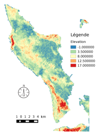
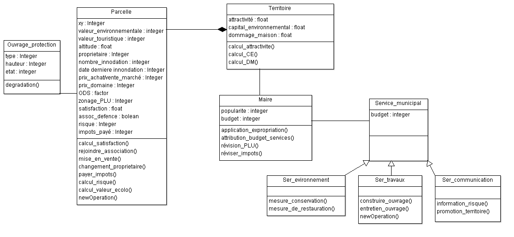
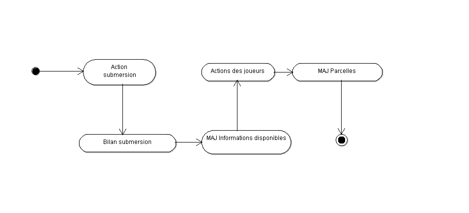

Fiche pédagogique | Modèle Sprite | Juin 2015
------|-------|--------
Collectif MAPS||MAPS 8

**Domaine d’application**:
Modélisation d'accompagnement, et d'aide à la décision

**Spécificité pédagogique**: Ce modèle est destiné à être joué avec des élus et décideurs. Ceux-ci doivent mettre en place une stratégie de gestion territoriale à l'échelle de l'île d'Oléron.

**Niveau du public visé**: Un public de non-initiés à la modélisation multi-agents. Les joueurs jouant contre la machine.

**Niveau thématique**: Débutant

**Nom du modèle correspondant**: Sprite

**Version NetLogo nécessaire**: GAMA 1.6.1

**Auteurs par ordre alphabétique**: [Carole Adam](mailto:carole.adam.rmit@gmail.com), [Marion Amalric](mailto:marion.amalric@univ-tours.fr),[Nicolas Becu](mailto:nicolas.becu@univ-lr.fr),[Etienne Delay](mailto:etienne.delay@gmail.com), [Odile Plattard](mailto:odileplattard@gmail.com), [Franck Taillandier](mailto:franck.taillandier@u-bordeaux.fr), [Mira Toumi](mailto:toumi.mira@live.fr)

#Sprite-Oléron

_Introduction et problématique_:

Notre objectif avec ce modèle est de permettre aux décideurs et acteurs locaux d’évaluer l’impact de leurs décisions, d’apprendre et de comprendre les implications de la gestion des risques sur leur territoire (île d'Oléron).

_Les questionnement scientifiques_ :

Le travail de définition des reflexes agents permet de clairement définir et explorer les types formalisés simples mobilisés sur les territoires. Cela consiste en un travail de rétro-ingénierie des motivations socio-spatiales des acteurs. Par ailleurs, la simulation participative permettra aux joueurs de toucher du doigt les difficultés de la prévention du risque.  

## Définition du modèle

Le modèle `sprite` a pour objectif d’amener différents acteurs du territoire à coopérer autour d’une problématique de gestion du territoire face au problématique de submerssion. Chaque acteur joue une personne de la Municipalité (Maire, service environnement, service communication, service travaux). L'objectif de l'équipe municipale est de gerer le territoire tout en tenant compte de différents indicateurs :

 * la satisfaction de la population
 * la qualité écologique
 * l'attractivité du territoire

Qui sont gérés par une grille d'automate cellulaire. Les acteurs doivent chercher un concensus dans les stratégies de gestion territoriale (aménagement de zone noire (interdite à la construction), construction de digues, etc.).

Dans cette version du jeu, l'équipe devra maintenir les indicateurs à un niveau de satisfaction de la population suffisant.

## Contextualisation du modèle
On se positionne ici dans un contexte de changement climatique (montée des eaux et augmentation des évènements climatiques extrêmes) sur un territoire à forte pression foncière (extension urbaine).

Par ailleurs, le territoire est particulièrement vulnérable à la submerssion, les altitudes variant entre -1m (zone de marécage) et 17m. Les Aléas "submersion", peuvent donc être très fort tout comme l’érosion du trait de côte.

Dans ce contexte, cela questionne les autorités territoriales (communes, communauté de communes, etc.) quant à la stratégie de gestion de ces risques.

## Fonctionnement du modèle

### Entitées, variables et échelles

_Entitées_

Dans le modèle `sripte` nous avons implémenté 3 types d'agents (c.f. Diagramme de classe): Les parcelles qui sont des celulles de grille et qui représentent l'entité spatiale de base du modèle.

Le maire et les agents des services municipaux seront joués par des joueurs humains, et leurs actions mettrons à jours les variables des agents de la grille.

_Variables_

Les parcelles ont des attributs :

 * La position (_XY_) : les cellules parcelles sont spatialisées
 * variables environnementales : indice de valeur environnementale
 * variables touristiques
 * altitude : extraite d'un modèle numérique de terrain (SRTM)
 * nombre d'innondation : un compteur du nombre d'innondation
 * date de la dernière innondation
 * fréquance d'innondation
 * ODS : occupation du sol (densité d'habitation)
 * zonage PLU : zone constructible ou non (zone noire)
 * satisfaction : soutient à la maire
 * risque : valeur aggrégée qui prend en compte la fréquance d'innondation et la diffusion de la prise en compte du risque
 * impots

### Scheduleur

Un tour de jeu est égal a une année et comprend la possibilité d'une submersion marine et le bilan de son impact.
La situation initiale est basée sur les données actuelles du territoire où les acteurs sont confrontés à une submersion marine. Cet événement leur  permet d’appréhender les effets de cet événement, et d’établir une stratégie commune de réduction des risques. Suite à ce bilan, le maire en concertation avec ses services  peut décider des actions à entreprendre dans la réalisation de la stratégie établie en étant conscient des conséquences de ses choix et dans l’éventualité de la survenue d’un évènement majeur en début du tour prochain.
Fin de la partie :
A la fin du nombre de tours prévus (=années)
Par perte de la popularité nécessaire à la réélection du maire.
Par classement en zone noire suite à un évènement (équivaut à des pertes humaines)

### Sous modèles

## Exploration du modèle
### Manipulation du modèle
Guide de manipulation du modèle et/ou exercice

Explication des résultats illustrés par des screen shot du modèle par exemple

### Exploration de l'espace des paramètres (optionnel)
Rechercher les bornes du modèle

Analyse de sensibilité, etc.
## Conclusion
Ce qu'il faut retenir du modèle

Les apports didactiques

Conseils d’utilisation de la fiche comme outil d’aide à l’enseignement.

Poser une ou deux questions pour voir si l'utilisateur a bien compris le modèle et la fiche (optionnel)

## Publications
Le modèle développé lors de MAPS 8 a fait l'objet de plusieurs Publications :
* Adam, Carole, Franck Taillandier, Etienne Delay, Odile Plattard, et Mira Toumi. « SPRITE – participatory simulation for raising awareness about marine submersion risk on the Oleron island. » In International Conference on Information Systems for Crisis Response and Management in Mediterranean Countries. Madrid, 2016.
* Taillandier, Franck, Carole Adam, Etienne Delay, Odile Plattard, et Mira Toumi. « Sprite : un modèle de simulation participative pour la sensibilisation au risque de submersion marine sur l’île d’Oléron. » Les annales du BTP, mars 2016, 8.

## Perspectives (Optionnel)
## Bibliographie
